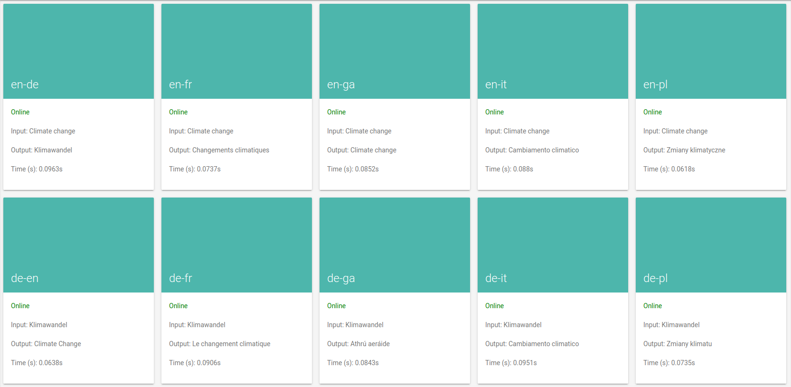

<a name="readme-top"></a>

[![Issues][issues-shield]][issues-url]
[![MIT License][license-shield]][license-url]
[![LinkedIn][linkedin-shield]][linkedin-url]

<!-- PROJECT LOGO -->
<br />
<div align="center">
  <a href="https://github.com/DanielGall500/Voss">
    
  </a>

<h3 align="center">Voss</h3>

  <p align="center">
    A web API built to securely and efficiently handle requests between users and machine translation models. 
    <br />
    <a href="https://github.com/DanielGall500/Voss/issues">Report Bug</a>
    ·
    <a href="https://github.com/DanielGall500/Voss/issues">Request Feature</a>
  </p>
</div>


<!-- TABLE OF CONTENTS -->
<details>
  <summary>Table of Contents</summary>
  <ol>
    <li>
      <a href="#about-the-project">About The Project</a>
      <ul>
        <li><a href="#built-with">Built With</a></li>
      </ul>
    </li>
    <li>
      <a href="#getting-started">Getting Started</a>
      <ul>
        <li><a href="#installation">Installation</a></li>
      </ul>
    </li>
    <li><a href="#usage">Usage</a></li>
    <li><a href="#improvements">Improvements</a></li>
    <li><a href="#contributing">Contributing</a></li>
    <li><a href="#license">License</a></li>
    <li><a href="#contact">Contact</a></li>
    <li><a href="#acknowledgments">Acknowledgments</a></li>
  </ol>
</details>

<!-- ABOUT THE PROJECT -->
## About The Project

<!-- [![Product Name Screen Shot][product-screenshot]](https://example.com) -->

Voss is an API built to securely and efficiently distribute translation requests among machine translation models, typically hosted on other servers. The API is built using Python 3.10 and implemented in FastAPI. This work was carried out at the [ADAPT Research Centre](https://www.adaptcentre.ie/) in Dublin City University for [EUComMeet](https://www.eucommeet.eu/objectives-activities-nutshell/), a completely open-source platform to facilitate discussions among EU citizens on important and current topics. It is currently in use for deliberations on the EUComMeet platform serving translation between six languages: English, German, French, Italian, Polish, and Irish. This API is complementary to earlier work carried out which has been recently published in MDPI Analytics ([Lohar et al, 2023](https://www.mdpi.com/2813-2203/2/2/22)).
The name stems from the influential German translator Johann Heinrich Voss, known for his translations of Homer's Odyssey and Iliad.
```mermaid
mindmap
  root((Voss API))
    MT Server C
        GPU 1
            DE to FR
            EN to FR
            FR to EN
            GA to EN
            IT to EN
            PL to EN
        GPU 2
            DE to GA
            EN to GA
            FR to GA
            GA to FR
            IT to FR
            PL to FR
    MT Server B
        GPU 1
           DE to IT
           EN to IT
           FR to IT
           GA to IT
           IT to GA
           PL to GA
        GPU 2
           DE to PL
           EN to PL
           FR to PL
           GA to PL
           IT to PL
           PL to IT
    MT Server A
        GPU 1
           DE to EN
           EN to DE
           FR to DE
           GA to DE
           IT to DE
           PL to DE
 ```
           
<p align="right">(<a href="#readme-top">back to top</a>)</p>

### Built With
The project is built using Python 3.10 and FastAPI, an asynchronous framework for developing APIs. It relies on Gunicorn and Uvicorn to improve performance by creating multiple Uvicorn workers to handle any incoming requests. 

* Server Configuration (SQLite)
    * The server configuration, that is, a table which provides the server name, model ID, and GPU to use for each MT model, is stored in a SQLite database and loaded using ```pysqlite3```, which is then loaded into a Python dictionary upon server startup. Further work on this project would take greater advantage of the features that comes with using SQLite.
* Preprocessing (Sacremoses)
    * Each translation request includes text which must be translated, and this text requires some pre-processing. We decided to handle this on the API side to reduce the load for the translation servers. Tokenization was carried out using ```sacremoses```, a popular tool for language tokenization.
* User Verification (Argon2, JWT)
    * Password creation and authentication uses Argon2 password hashing. Through the ```/login``` endpoint users can verify their authenticity and receive a JSON web token (handled by ```pyjwt```) which then must included in the headers of any translation request made to the server.

<!-- * [![FastAPI]][FastAPI-url] -->

<p align="right">(<a href="#readme-top">back to top</a>)</p>

<!-- GETTING STARTED -->
## Getting Started
To get a local copy up and running follow the following steps. On the initial setup, the dashboard should note all MT models as ```offline``` before you have properly configured the MT servers.

### Installation 
With only a few steps, you can run this API for yourself and connect it to the servers where your MT models are being hosted. For our use case, we were connecting to the built-in OpenNMT MT server.

1. Clone the repo
   ```sh
   git clone https://github.com/DanielGall500/Voss.git
   ```

2. Set up environment variables<br>
This API requires the user to set up a number of environment variables to be set up in ```app/.env``` which are loaded using the Python ```dotenv``` package. These variables will reference each machine translation server where the models are being hosted, as well as the secret key and algorithm for the creation and decoding of JSON web tokens (JWTs). 
The server names must match those contained within the server setup SQLite database. For instance, if our translation models are listed as using servers EUCOM_A, EUCOM_B, and EUCOM_C in the database, it must be listed like so in the environment variables.

    ```bash
    EUCOM_A_IP="[IP OF EUCOM_A]"
    EUCOM_A_PORT=60000

    EUCOM_B_IP="[IP OF EUCOM_B]"
    EUCOM_B_PORT=60000

    EUCOM_C_IP="[IP OF EUCOM_C]"
    EUCOM_C_PORT=60000

    SECRET_KEY="[YOUR SECRET KEY]"
    JWT_ALGORITHM=HS256
    ```

3. Create a Docker image and container<br>
Once you have set up your environment variables and a SQLite database, you can run this project using Docker.

    ```dockerfile
    FROM python:3.10

    WORKDIR /code

    COPY ./requirements.txt /code/requirements.txt

    RUN pip install --no-cache-dir --upgrade -r /code/requirements.txt

    COPY ./gunicorn_start.sh /code/gunicorn_start.sh
    COPY ./app /code/app

    CMD ["sh", "gunicorn_start.sh"]
    ```

An image and container can be created and run using the following commands: 

    docker build -t api-image .
    docker run -d --name api-container -p 8080:80 api-image

This will connect Docker's internal port 80 to our external port 8080. The latter port is the one which you will be concerned with, as the other is setup automatically in the ```gunicorn_start.sh``` file.

### Additional Setup
It is good practice to setup a reverse proxy such as Nginx to directly handle any incoming requests to your server for increasing security and performance. This was already handled by the institution in which this project was created, thus it wasn't necessary to implement here.

<p align="right">(<a href="#readme-top">back to top</a>)</p>

<!-- USAGE EXAMPLES -->
## Usage
We will now look at both how one can make translation calls to the API, as well as login with a username and password.

### Translate

Submit a translation request to the API. A JSON web token must be provided in the header, which is given to you once you log in.

**AUTHORIZATIONS:** JWTBearer

**REQUEST BODY SCHEMA:** application/json

- `src` (required): string (Src) - The source language.
- `tgt` (required): string (Tgt) - The target language.
- `text` (required): string (Text) - The text which you want to translate.

**Responses:**
- 201 Successful Response
- 422 Validation Error

**POST /translate**

**Request samples:**

```json
{
  "src": "en",
  "tgt": "de",
  "text": "Hello, my name is Daniel"
}
```

**Response samples:**

```json
{
    "status": "SUCCESS",
    "result": {
        "de": "Hallo, ich heiße Daniel",
    }
}
```

### Login

Log in using your username and password in order to receive a JWT. These details are stored in the SQLite database with hashed passwords.

**REQUEST BODY SCHEMA:** application/json

- `username` (required): string (Username)
- `password` (required): string (Password)

**Responses:**
- 201 Successful Response
- 422 Validation Error

**POST /login**

**Request samples:**

Payload
Content type: application/json

```json
{
  "username": "string",
  "password": "string"
}
```

**Response samples:**

Content type: application/json

- 201
- 422

```json
{
    "token": "eyJhbGciOi..."
}
```

<p align="right">(<a href="#readme-top">back to top</a>)</p>

## Improvements
The first version of this API was used in a pilot test of the EUComMeet project that took place in December of 2022. This pilot allowed us to see ways in which this version was difficult to work with, less than optimally secure, and not as efficient as other potential implementations. Version 2 was released in April 2023 and has made some major revisions. An overview of these revisions you can find below.
There were three primary focuses when developing Version 2:
* Reliability: Working towards eradicating bugs / server down-time. Rebuilding the web server from the ground up allowed for a focus on stronger design patterns. A dashboard has been created so that the current model status for each language pair can be checked at any time, and documentation allows developers to better understand each API endpoint for quicker debugging.
* Speed: Improving the speed of the API so that many more users could theoretically be served without noticeable latency. This involves both hardware and software improvements.
* Security: Steps taken to minimise chance of server security breach and Argon2 encryption of user login details has been implemented.

### Asynchronous Web Server
The API previously relied on Flask and Waitress which provided a WSGI server that could handle requests one at a time. This was changed to FastAPI, an open-source python framework specifically designed for building asynchronous RESTful APIs. This allows for multiple requests to be handled simultaneously and therefore better response times.

### Model Dashboard & Documentation
A dashboard GUI (view here) has been developed which displays the current status of each of the 30 language models, as well as the current translation latency for each model. From this dashboard one can also navigate to the documentation (view here) for the API, which contains the information needed in order to send requests and the types of responses one should expect. Note that without a username and password provided and stored by ADAPT, one cannot carry out any translations.

<p align="right">(<a href="#readme-top">back to top</a>)</p>

<!-- CONTRIBUTING -->
## Contributing

Contributions are what make the open source community such an amazing place to learn, inspire, and create. Any contributions you make are **greatly appreciated**.

If you have a suggestion that would make this better, please fork the repo and create a pull request. You can also simply open an issue with the tag "enhancement".
Don't forget to give the project a star! Thanks again!

1. Fork the Project
2. Create your Feature Branch (`git checkout -b feature/AmazingFeature`)
3. Commit your Changes (`git commit -m 'Add some AmazingFeature'`)
4. Push to the Branch (`git push origin feature/AmazingFeature`)
5. Open a Pull Request

<p align="right">(<a href="#readme-top">back to top</a>)</p>

<!-- LICENSE -->
## License

Distributed under the GPL-3.0 License. See `LICENSE.txt` for more information.

<p align="right">(<a href="#readme-top">back to top</a>)</p>

<!-- CONTACT -->
## Contact

Daniel Gallagher - [LinkedIn](https://www.linkedin.com/in/daniel-gallagher-a520161a3/) - daniel.gallagher.js@gmail.com

Project Link: [https://github.com/DanielGall500/Voss](https://github.com/DanielGall500/Voss)

<p align="right">(<a href="#readme-top">back to top</a>)</p>

<!-- ACKNOWLEDGMENTS -->
## Acknowledgments

* [Andy Way](https://www.dcu.ie/computing/people/andy-way)
* [Jane Dunne](https://www.linkedin.com/in/jane-dunne-686a9767/)
* [Pintu Lohar](https://www.adaptcentre.ie/experts/pintu-lohar/)
* [Guodong  Xie](https://www.adaptcentre.ie/experts/guodong-xie/)

<p align="right">(<a href="#readme-top">back to top</a>)</p>


<!-- MARKDOWN LINKS & IMAGES -->
<!-- https://www.markdownguide.org/basic-syntax/#reference-style-links -->
[contributors-shield]: https://img.shields.io/github/contributors/DanielGall500/TranslateAPI.svg?style=for-the-badge
[contributors-url]: https://github.com/DanielGall500/TranslateAPI/graphs/contributors
[forks-shield]: https://img.shields.io/github/forks/DanielGall500/TranslateAPI.svg?style=for-the-badge
[forks-url]: https://github.com/DanielGall500/TranslateAPI/network/members
[stars-shield]: https://img.shields.io/github/stars/DanielGall500/TranslateAPI.svg?style=for-the-badge
[stars-url]: https://github.com/DanielGall500/TranslateAPI/stargazers

[issues-shield]: https://img.shields.io/github/issues/DanielGall500/TranslateAPI.svg?style=for-the-badge
[issues-url]: https://github.com/DanielGall500/TranslateAPI/issues

[license-shield]: https://img.shields.io/github/license/DanielGall500/TranslateAPI.svg?style=for-the-badge
[license-url]: https://github.com/DanielGall500/TranslateAPI/LICENSE.txt

[linkedin-shield]: https://img.shields.io/badge/-LinkedIn-black.svg?style=for-the-badge&logo=linkedin&colorB=555
[linkedin-url]: https://www.linkedin.com/in/daniel-gallagher-a520161a3/

[product-screenshot]: images/screenshot.png

[MDL]: https://img.shields.io/badge/UI-Material%20Design%20Lite-purplehttps://getmdl.io/index.html
[MDL-url]: https://getmdl.io/index.html
[FastAPI]:  https://img.shields.io/badge/API-FastAPI-brightgreen
[FastAPI-url]: https://fastapi.tiangolo.com/
